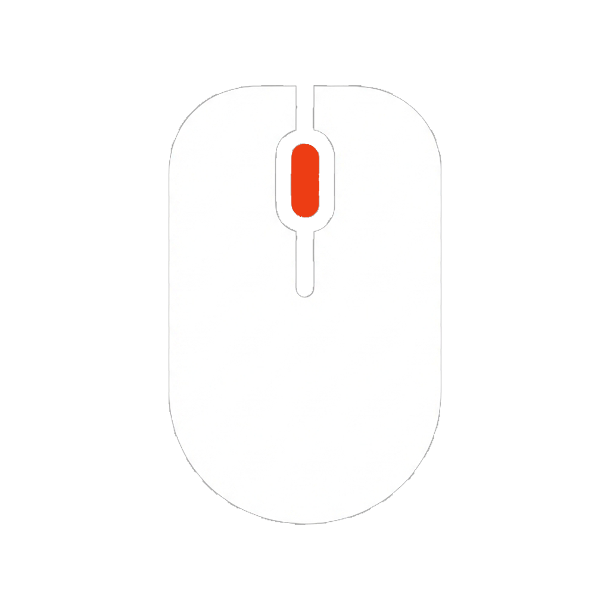
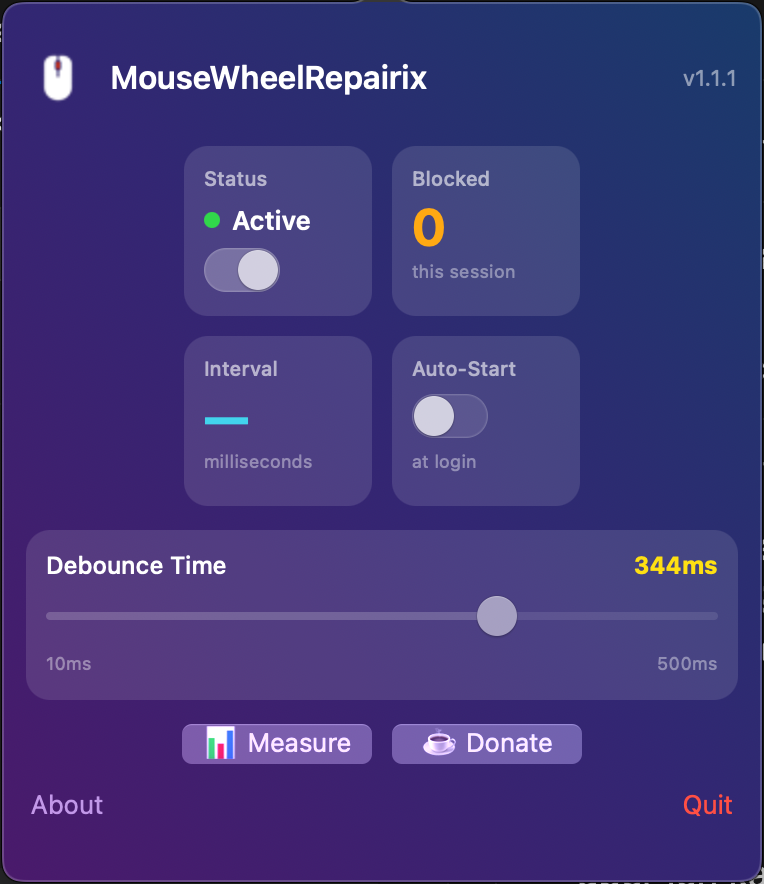
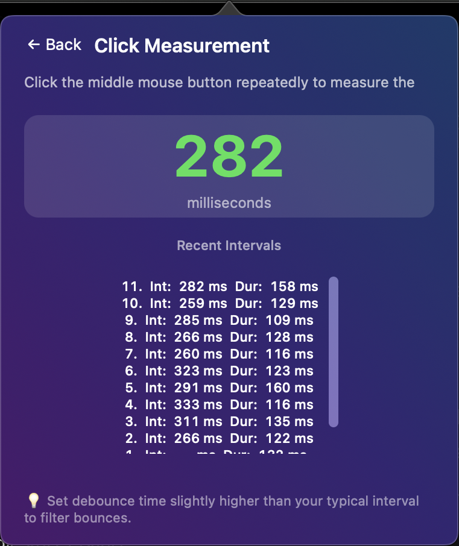

# MouseWheelRepairix

<p align="center">
  
</p>

**Fix erratic mouse wheel klicking on macOS** – A lightweight menu bar utility that debounces misbehaving klick wheel events.

<p align="center">
  
</p>

## 🎯 The Problem

Over time, the mouse wheel button (middle click) wears out and starts registering **double-clicks**:
- You click the mouse wheel once, but two clicks are registered
- Middle-click actions trigger twice unexpectedly
- Opening links in new tabs opens two tabs instead of one

**The cause:** The mechanical switch under the scroll wheel is worn and produces bouncing signals.

**The solution:** MouseWheelRepairix filters out these duplicate click signals (debouncing) – no need to open or replace your mouse!

## ✨ Features

- 🖱️ **Debounce scroll events** – Filters out erratic double-triggers
- ⚙️ **Configurable timing** – 50ms, 100ms, 200ms presets or custom values
- 📊 **Measurement tool** – Analyze your wheel's behavior to find optimal settings
- 🚀 **Start at login** – Set it and forget it
- 🌙 **Menu bar app** – Stays out of your way

## 📥 Installation

1. Download the latest `.dmg` from [Releases](https://github.com/ermuraten/MouseWheelRepairix/releases)
2. Open the DMG and drag the app to Applications

### ⚠️ "App is damaged" / "Cannot be opened"?

Since this app is not notarized by Apple (it's open source!), macOS Gatekeeper might block it.

**Solution 1 (Recommended):**
1. Click **"Done"** on the error message.
2. Open **System Settings** → **Privacy & Security**.
3. Scroll down – you should see: *"MouseWheelRepairix.app" was blocked because it is not from an identified developer.*
4. Click **"Open Anyway"**.
5. Enter your password if prompted.

**Solution 2 (Quickest):**
- **Right-click** (or Control-click) the app in Finder.
- Select **"Open"**.
- Click **"Open"** in the dialog box.

**Solution 3 (Terminal):**
If all else fails, run this in Terminal:
```bash
xattr -cr /Applications/MouseWheelRepairix.app
```

### Granting Permissions
On first launch, you will be prompted to grant **Accessibility Permissions**. This is required for the app to intercept and filter mouse clicks.

## 🔧 Usage

1. Click the mouse icon in your menu bar
2. Enable "Mouse Wheel Repair"
3. Choose a debounce time (start with 100ms)
4. Use "Measure Wheel Clicks" to fine-tune

### Finding the Right Debounce Time

<p align="center">
  
</p>

1. Open the Measurement tool from the menu
2. Scroll slowly and watch the intervals
3. If you see erratic values below 50ms, those are ghost clicks
4. Set your debounce time just above those erratic values

## 🛠️ Building from Source

```bash
# Clone the repository
git clone https://github.com/ermuraten/MouseWheelRepairix.git
cd MouseWheelRepairix

# Build the app
./scripts/build-app.sh

# Or create a DMG
./scripts/build-dmg.sh
```

## 📋 Requirements

- macOS 11.0 (Big Sur) or later
- Accessibility permissions

## 📄 License

MIT License – Feel free to use, modify, and distribute.

---

## ☕ Support the Project

If MouseWheelRepairix saved your mouse from the trash bin and you'd like to support its development, feel free to buy me a coffee! Every donation helps keep the project alive.

[**Donate via PayPal**](https://paypal.me/VeniceWaveRecords)

---

<p align="center">
  <sub>Made with ❤️ for frustrated mouse owners</sub>
</p>
